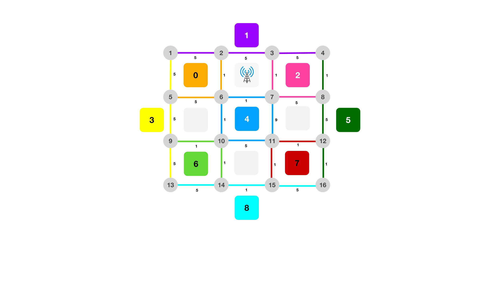
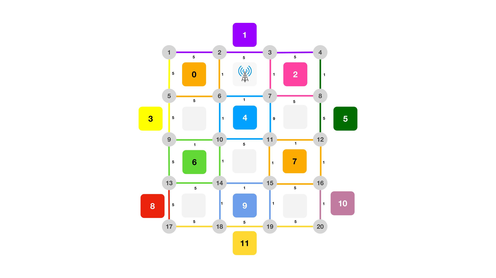
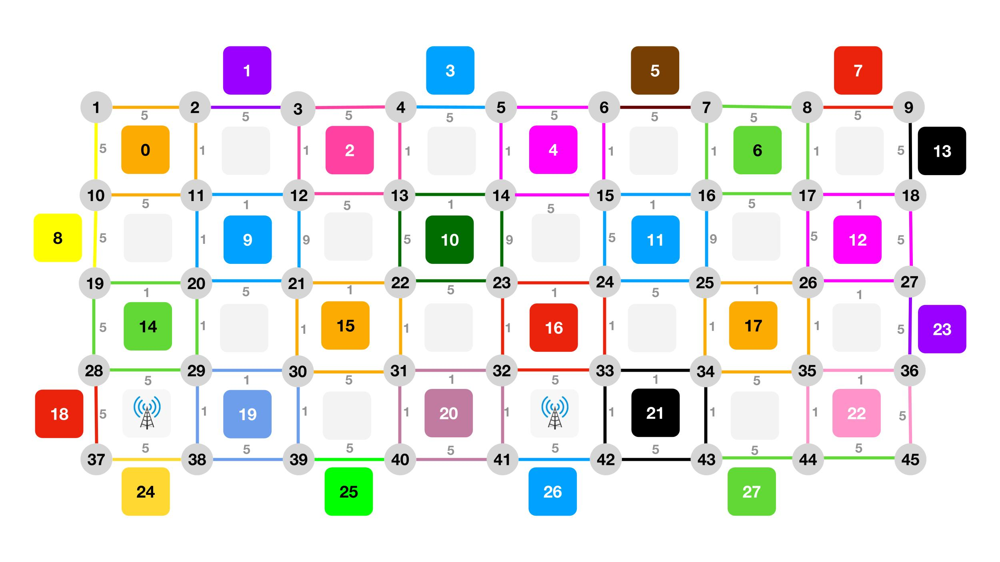

# Zero-Touch-FEC


## Description

DQN agent for optimal VNF placement in MEC systems for Connected Autonomous Vehicles

## Table of Contents

- [Usage](#usage)
- [Configuration](#configuration)

## Usage

To run the `agent.py` file and utilize the functionalities of this project, follow the steps below:

1. **Create a Virtual Environment**: We recommend creating a virtual environment using Python 3.10 to isolate the dependencies for this project. If you haven't already installed Python 3.10, you can download it from the official Python website: https://www.python.org/downloads/

   ```bash
   # Create a virtual environment with Python 3.10
   python3.10 -m venv venv
   ```

2. **Activate the Virtual Environment**: Activate the virtual environment to ensure that you are using the correct Python version and isolated dependencies.

   - For Windows:

   ```bash
   # Activate the virtual environment (Windows)
   venv\Scripts\activate
   ```

   - For macOS and Linux:

   ```bash
   # Activate the virtual environment (macOS and Linux)
   source venv/bin/activate
   ```

3. **Install Dependencies**: With the virtual environment activated, install the required dependencies using `pip`.

   ```bash
   pip install torch~=2.0.1 numpy~=1.24.3 flwr~=1.4.0 networkx~=3.1 pandas~=2.0.2 gym~=0.21.0
   ```

4. **Clone the Repository**: Clone this repository to your local machine using the following command:

   ```bash
   git clone https://github.com/carlos-UPC-AI/zero-touch-FEC
   ```
   
5. **Navigate to the Project Directory**: Change your current working directory to the root of the cloned repository:

   ```bash
   cd your_repository
   ```

6. **Run the `agent.py` File**: Now you can run the `agent.py` file using Python from the virtual environment. 

   ```bash
   python agent.py 
   ```

7. **Observing the Results**: After running `agent.py`, the script will execute and perform its intended task. 

Remember to deactivate the virtual environment when you are done using your project:

```bash
deactivate
```

## Configuration

The project requires some configuration settings to run correctly. You can find these settings in the `config.py` file located in the root directory of the project. Make sure to adjust these settings according to your environment.

### Environments
There are a total of three environemnts to choose from.

##### Small Environment



##### Medium Environment



##### Large Environment




The `agent.py` file is a crucial component of our project, responsible for defining the behavior of our intelligent agent in different environments. The agent can be configured to operate in three distinct environments. The choice of environment can be made in the `agent.py` file within the GLOBALS section by modifying the `ENV` variable. The available options for the `ENV` variable are:

1. `ENV_SMALL`: This environment represents a small-scale scenario. It is designed to facilitate quick testing and debugging, making it ideal for initial development and experimentation.

2. `ENV_MEDIUM`: This environment offers a moderate level of complexity, striking a balance between the simplicity of `ENV_SMALL` and the challenge of `ENV_LARGE`. It is suitable for intermediate testing and optimization stages.

3. `ENV_LARGE`: If you want to evaluate the agent's performance in a highly complex and realistic setting, this environment is the most appropriate choice. It presents a demanding and comprehensive scenario that reflects real-world challenges.

### Configuring the Environment

To choose a specific environment for the agent, follow these steps:

1. Open the `agent.py` file in your preferred code editor.

2. Locate the `GLOBALS` section within the file.

3. Look for the variable named `ENV`.

4. Assign one of the available options (`ENV_SMALL`, `ENV_MEDIUM`, or `ENV_LARGE`) to the `ENV` variable.

5. Save the changes to the file.

### Configuring the trainning 
